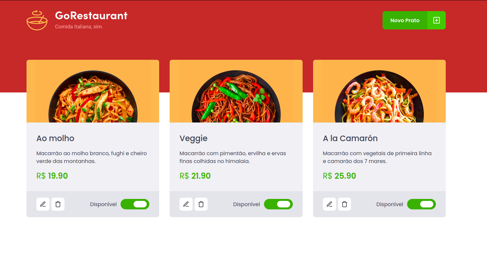

# Nivel 5 desafio 10: GoRestaurant-Web


#

<p> Desenvolvimento da GoRestaurant. Colocando em praticar o que você aprendeu até agora no React.js junto com TypeScript, praticando o conceito de CRUD (Create, Read, Update, Delete).</p>

<P>Resultado dos testes:</p>


<p>Para executar apalicação, digite os seguintes comandos:</p>

Para servidor server.json:

```js
  yarn json-server server.json -p 3333
```


Para aplicação web:
```js
  yarn start
```

<P>Imagem da aplicação desenolvidda</p>


<h4>link para o desafio :
https://github.com/rocketseat-education/bootcamp-gostack-desafios/tree/master/desafio-reactjs-crud </h4>
